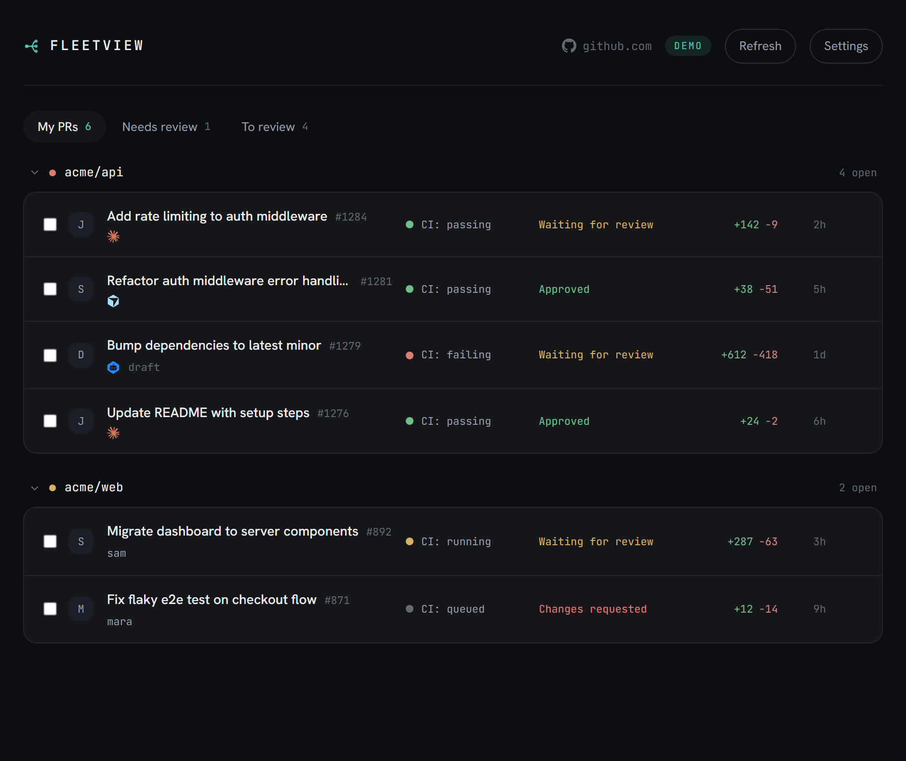

# FleetView

[Live demo](https://alessandrorodi.github.io/fleetview/) — opens in demo mode, no token or sign-up.

A lightweight, client-side dashboard for triaging a lot of open GitHub pull requests at once. It's for when you're running a fleet of AI coding agents that each open their own PR and GitHub's one-PR-at-a-time UI falls over.



There's no backend and no codebase access. FleetView is a static frontend that talks straight to GitHub's GraphQL API from your browser. Your token and PR data only ever go to GitHub; there's no server of ours for them to pass through.

## Why

GitHub has no good way to *manage* a large number of concurrent PRs. The tools that try (the better-diff and review products) usually clone your code to their servers to do it, which a lot of security teams won't allow and which is overkill when the real problem is triage at scale. FleetView stays in the browser and works on the many-PRs problem instead of the single-diff one.

## Features

- One board with every open PR across the repos you choose, grouped by repo and collapsible.
- Three tabs: your PRs, PRs awaiting your review (`review-requested:@me`, which you can toggle off), and your own PRs still waiting on a reviewer.
- Agent detection by author, branch prefix (`claude/`, `cursor/`, `codex/`, `devin/`, `copilot/`), or the attribution agents write into the PR body, so it catches agents that push under your own account. Each one gets its vendor mark.
- A CI status light per PR (passing, failing, running, queued) that links to the checks tab, plus review state, diff size, and age.
- A copy-link button on every row, and bulk approve / merge / close with a progress modal. These need a write-scoped token, and Approve only shows up for PRs you didn't author (GitHub blocks self-approval).
- Keyboard triage: `j`/`k` to move, `x` to select, `o` to open.
- Paginated fetch for large fleets, with a "showing X of Y" note when it caps out.
- Dark and light themes, plus a demo mode that needs no token.
- No external runtime calls: fonts and vendor marks are bundled, so the only network traffic is your browser to GitHub. Works offline and air-gapped.

## Privacy and security

- The app is static files. The only network calls go from your browser to GitHub's GraphQL API.
- Your token lives in `localStorage` and is sent only to GitHub.
- Because it runs in your browser, it reaches an internal GitHub Enterprise Server the same way you do. Nothing needs inbound access to your network, there are no SaaS IPs to allowlist, and there's no third-party OAuth app to approve.

## Works with

| Flavor | Host setting | Endpoint used |
| --- | --- | --- |
| github.com | `github.com` | `https://api.github.com/graphql` |
| Enterprise Cloud | `github.com` (or your `*.ghe.com` tenant) | `https://api.github.com/graphql` |
| Enterprise Server (GHES) | `github.acme.com` | `https://github.acme.com/api/graphql` |

> GHES note: some GHES instances don't send permissive CORS headers, which can block a browser app served from another origin. If you hit that, self-host the static `dist/` on an allowed origin, or use the browser-extension build once it lands (see the roadmap), which gets around CORS with host permissions.

## Quick start

```bash
npm install
npm run dev
```

Open the dev URL, click Settings, and set:

1. Host: leave it as `github.com`, or enter your GHES host.
2. Token: a [fine-grained PAT](https://github.com/settings/personal-access-tokens) with read access to the repos you care about (Pull requests: Read and Contents: Read; Metadata is implied). For an org's fleet, authorize the token for that org and complete SSO authorization if your org requires it.
3. Search query: defaults to PRs that involve you. For a whole org, use `org:acme is:open is:pr`.

Then click Save & load.

### Build a static bundle

```bash
npm run build      # outputs to dist/
npm run preview    # serve the production build locally
```

`dist/` is plain static files, so you can host it anywhere: GitHub Pages, Netlify, an internal server.

## Roadmap

- A browser-extension build for zero-setup auth via your github.com session and CORS-free access to GHES.
- Sorting and saved views (by age, CI, or review state).
- An optional bring-your-own-key LLM pass for per-PR risk and summaries, run in the browser against the diff (still no server).

## Stack

Vite, React, and TypeScript. No server, no database.

## License

MIT. See [LICENSE](./LICENSE).
